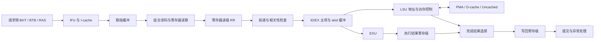

# RV32 面试准备：实际结构、参数与选择理由

核对日期：2026-09-06。对象为 `rv32-interview` 工作树、`NPC_CONFIG=rv32-baseline`，
包含定时中断、时序修复、译码级合并和 LSU 成功完成拍发射优化。只讨论 RV32。

主要架构与简历相符，但不应把简历原文的每个细节都说成当前默认配置。
面试以本页作为当前结构说明；历史版本与验证过程见 [简历逐项核对](RV32_RESUME_AUDIT.md)。

## 1. 先用一段话准确介绍

这是一个 RV32I 单发射顺序处理器，支持 Zicsr、Zifencei 和基础 M-mode 异常、定时中断
及 mret。流水线用 Valid/Ready 处理不同模块的延迟和反压，用前递减少数据相关等待，
用发出和完成顺序约束保证精确异常。前端包含指令缓存和小型 BHT/BTB/RAS，数据侧是
阻塞式写回缓存及非缓存通路。取指、数据访问分别产生 AXI 请求，在系统层仲裁并接入
ysyxSoC。设计取舍通过功能测试、完整程序计数器和综合时序面积共同检查。

“面向边缘设备”是应用方向，当前没有据此完成 AI 指令扩展、推理加速器或模型性能验证。

## 2. 当前结构该怎么画

这是数据流图，预测纠错、前递返回、flush 和中断控制线未全部画出。
取指、译码、执行、访存、写回、提交是功能划分，不能据此称为“固定六级流水线”。
EXU 与 LSU 是从执行包分出的两条路径，不是所有指令都顺次经过 EX 结果级再进入 LSU。
提交负责架构状态更新，不是一个 ROB，也不自动等于另一级流水寄存器。

近期变化是撤去 `u_decode_stage` 的实例，组合 IDU 直接接寄存器读级；源文件仍保留作
历史对照。RR、ID/EX、执行结果级和写回级仍存在。配置包中的 PHYS_REG_COUNT、
ROB_ENTRY_COUNT 等预留常量，不能用来证明当前实例化了重命名、ROB 或乱序执行。
准确连接以 [core](../../vsrc/riscv32/core/riscv32_core.sv) 为准。

## 3. 参数、理由和证据要分开讲

| 当前选择 | 为什么采用这个结构 | 依据与尚未证明的部分 |
| --- | --- | --- |
| RV32I，32 个 32 位 GPR，单发射顺序执行 | 先完成可验证的流水线、异常和 SoC 系统；相较 RV32E 保留 32 个架构寄存器，相较乱序不引入重命名和 ROB | 这是项目范围选择；未证明它是所有边缘应用的最佳 ISA/微架构 |
| Valid/Ready 弹性接口 | 缓存缺失、总线反压会改变完成时间，需要明确每次传递是否被接收 | `valid && ready` 才消费一次；稳态一拍一条还取决于旁路、队列和下游能力，协议本身不保证 IPC=1 |
| 保留 RR 和执行结果级 | 把过长的读取、前递、计算及控制反馈路径分开 | 本轮继续合并 RR 的候选在 820 MHz 下 setup slack −0.105 ns，已否决；多一级也增加寄存面积和恢复延迟 |
| I-cache 256 B，1 路，16 B/行，即 16 组 | 用小阵列降低数据存储、tag 比较和命中选择成本；相联度越高，选择逻辑通常也越复杂 | 支持两路配置，当前没有选两路；已有历史探索，但本轮未重扫所有容量/路数，不能宣称单路 256 B 为当前全局最优 |
| D-cache 256 B，2 路，16 B/行，即 8 组 | 保留小容量数据复用，并用两路减轻同组冲突 | 历史同容量 A/B 的 IPC 0.303015→0.334515，纯核面积 58899.848→59696.784 μm²；这是 2026-08-25 的 test 证据，不是当前校准 train 的增益 |
| I/D 行长均为 16 B | AXI 数据宽 32 位，整行需要 4 个 beat；在 tag 开销、空间局部性、传输占用之间取舍 | 更长的行可能降低 miss，也可能增加无用流量和阻塞时间；未在当前 820 MHz 环境完整重扫，不能说 16 B 已被证明最优 |
| I-cache 单个活动缺失，支持 Early Restart | 所需字到达后先响应，缩短等待，同时控制缺失跟踪状态规模 | 不改变 burst 传输顺序，不等于 critical-word-first，也不等于支持多个并发 miss |
| 阻塞式 Write-Back/Write-Allocate D-cache | 写命中先更新本地数据和 dirty 位，替换时写回；写缺失把行取回后合并 store | 减少重复写向下层的机会，但引入脏行写回、异常处理和 FENCE.I 维护；未做当前版本 WB 与 WT 的完整 A/B，不能说 WB 在所有负载下更优 |
| BHT 16 项，每项 2-bit 饱和计数器 | 用少量方向状态处理条件分支 | 历史 trace/计数器表明扩至 64 项收益较小；这支持先保留小表，不证明换程序仍然如此，也不是当前 gshare/TAGE 实现 |
| BTB 总共 16 项，2 路，即 8 组 | 保存控制流 PC 对应的目标，查询不用等到执行级；两路与容量共同影响冲突和读取逻辑 | Makefile 留有 16 与 32 项的历史选择说明；本轮未重新取得完整容量扫描，面试不能给出虚构的当前收益百分比 |
| RAS 4 项 | 根据调用/返回信息预测返回地址，补充普通目标表 | 历史 trace 中扩至 8 项仅额外减少 250 次错误，先保留 4 项；深调用、溢出和其他程序仍可能需要更大深度 |
| IFU lookup 队列 2 项，预测查询分两级 | 保存等待配对的请求/预测信息，并分隔表项读取与 tag/目标选择路径 | 两个弹性查询级能在允许时同拍移出和接收；不代表端到端任何控制流下都能一拍取一条，也不代表两个并发缓存缺失 |
| I/D 独立 AXI manager，系统层共享与路由 | 核内取指和数据接口分开，SoC 接口按既定总线边界集成 | I/D-cache 分离不等于拥有两套完全独立的外部内存带宽 |

参数来源：[Makefile](../../Makefile)、[配置包](../../vsrc/riscv32/common/riscv_config_pkg.sv)、
[IFU](../../vsrc/riscv32/core/riscv32_ifu.sv)、
[预测器](../../vsrc/riscv32/core/frontend/riscv32_fetch_control_flow_predictor.sv)。
历史数值来源：[实验日志 2026-08-25](../verification/EXPERIMENT_LOG.md)。
旧文档中的“BTB16x2”命名容易误解，当前统一说“16 项、8 组、2 路”。

## 4. 面试中必须能解释的控制问题

**为什么不是有结果就立即 bypass？**
先选择程序顺序中最近的同名寄存器生产者，并确认结果可用。若更近的生产者是尚未完成
的 load，不能退而取更老 WB 的值。当前 load 结果经过 WB 再供前递，牺牲部分 load-use
延迟以控制组合路径。要改成更早前递，必须同时检查数据/异常有效性、关键路径和实测收益。

**为什么 RR 停顿时还更新操作数？**
它保存的是读取时的操作数快照。如果等待期间生产者完成 WB，只保持旧快照会错过这次
更新。因此 RR 在反压时监听匹配的 GPR 写回。内部暂存快照的更新不能被机械地视为普通
事务 payload 违规变化，要按这个模块的专用接口契约检查。

**为什么 LSU 忙会阻止无关指令？**
当前没有保存大量年轻完成结果并按年龄提交的队列，限制发出与完成顺序可以简化精确异常。
本轮仅放开“旧 LSU 已成功交付 WB 的当拍”：年轻 ALU 结果进入空的执行结果寄存器，
最早下一拍进入完成选择器。旧 load 的依赖、新访存、错误响应、结果反压仍有约束。
这与直接删掉 busy 条件、允许年轻指令提前提交不同。

**store 有副作用，为什么还能精确异常？**
必须说明请求发出前已经排除了更老指令尚未解决的控制/异常风险，并防止年轻 store 越过
未完成的老指令；不能声称所有 store 都到 commit 才写总线。总线已经接受的写事务也不能
靠 flush 撤销。涉及设备错误时，还要说明总线目标的响应语义和已完成副作用边界。

**缓存替换用的是什么？**
当前代码优先找无效 way，否则使用按安装/替换推进的 way 指针；不要自动称作 LRU。
它减少状态与更新逻辑，但不利用完整的近期访问顺序，命中率要靠具体负载验证。

**为什么 FENCE.I 不能只清 I-cache？**
程序可能通过 D-cache 写入新的指令字。需要先处理旧取指请求和脏数据写回，再使 I-cache
失效并恢复取指。还应能指出维护期间停止/排空请求的状态，以及维护出错时的处理边界。

**有 CLINT 就等于有中断吗？**
还要形成 `mtime >= mtimecmp → MTIP → MIE/MTIE → 安全边界受理 → trap → mret`
的完整路径。当前新增的是 M-mode 定时中断：停发/排空后受理，中断不伪装成一条退休指令。
没有据此实现外部中断控制器或软件中断；也没有因此自动完成 RT-Thread 的调度验证。

## 5. 一个可以完整讲清的实际取舍

本轮所有硬件候选使用同一 train 镜像、旧计时环境、缓存/预测器参数、NanGate45 库和
820 MHz STA 约束；面积包含同一种复位边界与缓冲策略，不含 CLINT/SoC。

| 候选 | 面积 μm² | train 周期 | train IPC | 820 MHz setup slack | 决定 |
| --- | ---: | ---: | ---: | ---: | --- |
| 本轮基线 | 79,002.532 | 670,929,314 | 0.278435 | +0.036 ns | 对照 |
| 合并译码寄存级 | 78,095.206 | 659,679,012 | 0.283184 | +0.034 ns | 面积和周期均改善 |
| 再合并 RR | 76,795.530 | 未测 | 未测 | −0.105 ns | 不满足本轮频率约束，恢复 |
| 合并译码 + LSU 成功完成拍发射 | 78,163.036 | 653,329,501 | 0.285936 | +0.049 ns | 当前保留 |

通过的三组 train 均退休 186,810,217 条指令，十项 PASS、GOOD TRAP。
当前方案比基线面积少 1.06%，周期少 2.62%，IPC 高 2.69%；相较只合并译码多用
67.830 μm²，换得少 6,349,511 拍。说明理由时要同时讲“省了哪组状态/等待”与
“新增了什么组合依赖”，不能仅报一个更好的 IPC。

当前旧环境的观察周期中，恢复等待约 21.24%、LSU 阻塞约 25.33%、指令传递空泡约
24.84%。分类有优先级，不是互相独立的因果损失，也不能将全部恢复等待等同于预测错误
本身的固定罚拍。这些数据说明仍有瓶颈，不支持声称已经做到最低面积或最优流水划分。

详见 [实验报告](../verification/RV32_HARDWARE_OPTIMIZATION_2026-09-06.md)及
[原始比较结果](../../result/performance/rv32-hw-opt-20260906/comparison.json)。

## 6. 简历中要改准的细节

- “参数化两路 I-cache”改为“参数化组相联 I-cache，支持两路配置”；讲参数时注明当前 1 路。
- “支持异常/中断”具体说明基础 M-mode 同步异常与定时中断，不扩大为所有中断类别。
- “逐指令比对访存副作用”不能由当前 DiffTest 推出；实际比较 PC、GPR 和关键 CSR，
  总线与访存行为另用 Trace、SVA 和定向测试检查。
- 当前可复现 STA 流程使用 Yosys/Slang 与 iEDA/iSTA。原文的 OpenSTA 需要对应使用证据。
- 69,448.61 μm² / 766.875 MHz 是历史配置结果。当前本轮验收边界约 78,163 μm²，
  820 MHz 综合后 max/min 与门控时钟检查通过；不是布局布线后频率或 SoC 总面积。
- SoC Bare-Metal 的本轮 test/train 已通过；RT-Thread 仍需补齐对应版本的运行证据。
  AM 定时中断系统自检不等于异步中断 DiffTest 或完整 RTOS 调度验证。

性能数字也要附环境：当前同一 RTL 在明确配置 CPU 820 MHz、设备 100 MHz 的模型中，
完整 train 为 1,089,343,319 拍、IPC 0.171489、Scored time 1.328498 s、Total time
1.953871 s。它与上表的旧计时模型不同，不计算跨行硬件加速比，也暂不与来源条件未明的
官方 4.49 s 比较。详见 [计时规则](../verification/MICROBENCH_TIMING_RULES.md)。

## 7. 后续工作以什么为准

面试准备先固定上述结构和参数，不为了让数字好看而临时改变架构。每个后续优化都说明：
原问题与触发条件、候选改动、正确性约束、预期代价、同环境结果和是否保留。
已经有实验的选择按实验讲，暂时只有工程理由的选择如实说明，不能事后编造最优性依据。
下一轮若继续扫缓存/预测器，应在统一计时环境下重新做参数对比，并同步更新本页和简历。
