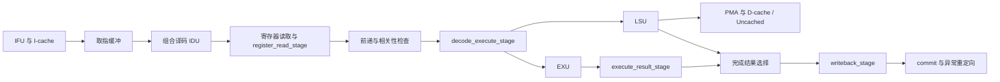

# RV32 版本：简历核对与面试准备

当前面试结构、参数及选择理由以 [RV32 设计选择](RV32_DESIGN_CHOICES.md) 为准。
本页保留恢复、中断、时序和性能测量的阶段记录。最新工作树已合并译码寄存级并允许
LSU 成功完成拍发射独立 ALU；完整 train 已通过，最新验收边界面积 78,163.036 μm²，
820 MHz 综合后 max/min 与门控时钟检查通过。旧阶段的数字不应作为当前结果使用。

核对日期：2026-09-06。恢复基点为 bb03677；随后在本工作树增加了 M-mode 定时中断。本文只讨论 RV32，区分恢复时的历史状态和本次新增实现。

## 1. 面试使用哪一份代码

- 工作目录：`/home/yong/ysyx/ysyx-workbench-rv32-interview`
- 分支：`rv32-interview`
- 恢复来源：`bb03677d1ea6670059391328f1a61b69fb8f35ea`，历史 `tracer-ysyx` 可达提交。
- 构建配置：`PROJECT=riscv32 NPC_CONFIG=rv32-baseline`。
- 恢复时保留了原 RTL、软件、实验记录和历史综合产物；随后按完整流水线重新接入定时中断，并新增测试和设计记录。原 RV64 工作目录和 `rv32-timer-interrupt` 工作目录继续保留。

外部仓库按该提交记录的版本建立独立工作树：

| 仓库 | 提交 |
| --- | --- |
| am-kernels | `c4088239e2425ffcb3cccd0fd603872d6c745fbb` |
| ysyxSoC | `a9fe2e0421291c40c2ae38e7507a399b6617a859` |
| yosys-sta | `72495ad5619a9d5053c3a2748db1b295d5df3fb4` |
| nvboard | `900991bf0fde6284bad629d2ff66777b6eaa41f9` |

恢复源码不等于所有外部工具、生成文件和历史运行环境都已重建。下面分别列出代码实现、本次验证和历史记录。

## 2. 原简历逐项核对

总体判断：流水线、缓存、总线和验证工具的主要结构能够对应；原文不能原样作为这一提交的功能清单。

| 原简历内容 | 判断与面试表述 | 主要证据 |
| --- | --- | --- |
| RV32I 单发射顺序核，Valid/Ready，前递、停顿、清空、重定向 | 有对应实现。取指、译码、执行、访存、写回、提交是功能划分，不要据此说成固定六级寄存流水线。 | [core](../../vsrc/riscv32/core/riscv32_core.sv)、[hazard controller](../../vsrc/riscv32/core/riscv32_pipeline_hazard_controller.sv) |
| 精确异常，Zicsr、Zifencei、基础 M-mode、mret | 有同步异常、CSR、返回和 FENCE.I 路径。应说“基础 M-mode”，不扩大为完整特权规范实现。异常指令不进行正常 GPR/CSR 提交；还要说明访存发出的顺序约束。 | [commit](../../vsrc/riscv32/core/riscv32_commit.sv)、[trap controller](../../vsrc/riscv32/core/riscv32_trap_controller.sv)、[CSR](../../vsrc/riscv32/core/riscv32_csr_file.sv) |
| 支持中断 | **恢复基点未支持；当前工作树已新增 M-mode 定时中断。** CLINT 比较值、MTIP、MIE/MTIE、流水线排空受理和 mret 形成完整路径。中断独立于普通 commit，不伪造退休事件；不包含外部中断、软件中断或 PLIC。 | [commit](../../vsrc/riscv32/core/riscv32_commit.sv)、[CLINT](../../vsrc/riscv32/system/peripheral/riscv32_axi4_clint.sv) |
| 参数化两路 I-cache，Burst Refill，Early Restart | 设计支持两路；**rv32-baseline 默认 256 B、单路、16 B 行**。应说“参数化组相联 I-cache，支持两路配置”。Early Restart 是所需字返回后提前响应，不是改变 Burst 顺序的 critical-word-first。 | [Makefile](../../Makefile)、[I-cache](../../vsrc/riscv32/core/frontend/riscv32_icache.sv)、[miss unit](../../vsrc/riscv32/core/frontend/riscv32_icache_miss_unit.sv) |
| PMA/Uncached，阻塞式 Write-Back/Write-Allocate D-cache | 已接入 CPU 数据路径。默认启用，256 B、两路、16 B 行；有脏行写回、整行重填、清理接口。不能说被删除或只是独立实验模块。 | [数据存储子系统](../../vsrc/riscv32/core/memory/riscv32_data_memory_subsystem.sv)、[D-cache](../../vsrc/riscv32/core/memory/riscv32_dcache.sv) |
| AXI4 Master、取指/访存仲裁、路由和错误响应 | 有对应实现。应区分核内缓存请求接口、AXI Master、共享总线仲裁和 SoC 适配各自职责。 | [core merge](../../vsrc/riscv32/system/riscv32_axi4_core_merge.sv)、[地址路由](../../vsrc/riscv32/system/riscv32_axi4_address_router.sv)、[错误目标](../../vsrc/riscv32/system/riscv32_axi4_error_target.sv) |
| 接入 ysyxSoC，启动代码、链接脚本，运行 RT-Thread/Bare-Metal | 有 SoC 适配、构建入口和软件适配。恢复后的 AXI SDRAM SoC 已通过 MicroBench test/train 裸机程序；RT-Thread 未重跑。早期归档提过 RT-Thread 启动，但不证明当前完整运行调度/中断；当前 SoC AM 配置使用 dummy CTE。面试不要将“启动输出”扩展成“完整 RTOS 支持”。 | [AM 源码](../../../abstract-machine/am/src)、[早期架构归档](../architecture/archive/RV32_ARCHITECTURE_PLAN_2026-07-30.md) |
| Reference Model、DiffTest、Trace、SVA、Directed Test | 有对应代码。参考模型基于 NEMU，宜写“基于 NEMU 建立差分验证流程”，避免暗示整个参考模型独立从零开发。 | [DiffTest](../../csrc/difftest.cpp)、[NEMU](../../../nemu)、[测试](../../tests) |
| 逐指令比对 PC、GPR、CSR 与访存副作用 | **原文扩大了 DiffTest 范围。** 实际比较 PC、32 个 GPR 和 `mstatus/mtvec/mepc/mcause/mtval`；访存 Trace 和定向测试不等同于逐次存储副作用的参考模型比对。 | [checkregs/difftest_step](../../csrc/difftest.cpp) |
| PMU、CacheSim、BranchSim，IPC、Miss Rate、AMAT、预测准确率及参数探索 | 有硬件计数器、仿真监视器和离线工具。应分清哪些统计来自 RTL PMU，哪些来自仿真或离线模型；离线模拟结果不能直接当作处理器实测结果。 | [PMU](../../vsrc/riscv32/core/riscv32_pmu.sv)、[仿真监视器](../../vsrc/riscv32/sim)、[工具](../../tools) |
| Verilator/Yosys/OpenSTA 自动化，69,400 μm²、767 MHz | 有构建、综合、STA 入口和历史实验记录。2026-09-06 核查可用流程实际使用 Yosys 与 iEDA/iSTA；OpenSTA 经历需要另行提供证据。数字对应历史 RV32 小缓存纯核配置，历史数值不能证明精确对应 bb03677；中断接入后、时序优化前复测得到 **78,942.15 μm²、820.127 MHz**，见[复测报告](../verification/RV32_INTERRUPT_PPA_2026-09-06.md)。应说“基于工具建立/整合流程”，区分自身脚本与框架已有流程。 | [实验记录](../verification/EXPERIMENT_LOG.md)、[历史 STA 产物](../../result/sta) |

“面向边缘设备”可以表达项目方向，但当前证据是通用 RV32 处理器和 SoC 集成，不能据此声称完成 AI 推理专用优化、加速器或特定模型性能验证。面试标题使用“一生一芯｜RV32I 处理器设计与 SoC 集成”更明确。

## 3. 当前配置和历史 PPA 的边界

`rv32-baseline` 的 XLEN、GPR 宽度、地址和 AXI 数据宽度为 32 位，32 个通用寄存器；I-cache 256 B/1 路/16 B 行，D-cache 256 B/2 路/16 B 行；预测器默认 BHT 16 项、BTB 总共 16 项（8 组×2 路）、RAS 深度 4。旧文档曾将 BTB 总项数误写成组数，现按实际参数定义纠正。参数以 [Makefile](../../Makefile) 和 [配置包](../../vsrc/riscv32/common/riscv_config_pkg.sv) 为准。

[EXPERIMENT_LOG](../verification/EXPERIMENT_LOG.md) 的历史记录给出 `69448.610 μm²` 和 `766.875 MHz`，该记录的 Commit 写的是 `uncommitted`。恢复的仓库保存了相应目录中的展平源码和映射网表，但未保存完整原始 `synth_stat.txt`、STA 报告；2026-09-06 已重新综合当前工作树，并复查历史网表，见下文更新。

因此这组数可以作为**历史 RV32 小缓存配置的实验结果**介绍，不能写成“当前提交已复现”。面积是纯核标准单元映射面积，不是 SoC 芯片面积；频率是综合后 STA 估算，不是布局布线后签核频率或板上实测时钟。不要把 1 GHz 约束说成满足 1 GHz 时序。

## 4. 沿代码讲清实际结构



上述图描述连接关系；LSU 的完成结果进入完成选择器，存储子系统通过请求/响应服务 LSU。提交是架构状态更新与异常处理的控制边界，不意味着每个功能框都多一级流水寄存器。

建议按以下顺序阅读，并能直接指出对应信号：

1. `riscv32_core.sv`：请求、结果和重定向的连接；先区分各级有效、接收和真正握手的条件。
2. `register_read_stage`、`decode_execute_stage`、`execute_result_stage`、`writeback_stage`：各级保存什么，何时推进，停顿时如何稳定，清空优先级是什么。`decode_stage` 源码保留，但本轮已不在当前 core 中实例化。
3. `pipeline_hazard_controller` 和 core 中的前递选择：来源优先级、load-use 停顿、串行操作和访存发出限制。
4. `commit`、`csr_file`、`trap_controller`：异常如何携带至处理点，如何记录 PC/cause/tval，mret 如何恢复状态。
5. `icache`、`dcache`、各自 miss unit 和 AXI master：命中、缺失、写回、重填、返回错误以及背压。
6. `difftest.cpp`、RTL 定向测试、实验日志：每个“支持”和“优化”分别用什么证据说明。

### 需要能回答的具体问题

**前递是否只要有结果就使用？** 还要保证它来自程序顺序上最近的生产者。core 中 WB、已保存执行结果、当前 EX 结果按新旧关系覆盖选择；若更近的生产者尚未就绪，不能误用更老的同名寄存器结果。load 返回没有接一条长组合路径直接进入执行输入，而是经写回供相关指令使用；由此需要停顿。

**为什么有单独的寄存器读取级？** 用寄存器边界分隔寄存器堆读取与后续前递/执行路径。`register_read_stage` 停顿时仍会用匹配的写回结果更新保存的操作数，避免一次写回在停顿期间发生后被错过。应结合源寄存器索引和有效位说明。

**Valid/Ready 的意义是什么？** 仅在 valid 与 ready 同时成立时转移一次事务；被背压时保持未消费的内容，flush 时清除被取消的有效项。组合 ready 及旁路会影响关键路径，不能只把协议名当成性能保证。

**顺序核为什么还要检查精确异常？** 较年轻指令不得在较老指令异常后留下不应发生的架构副作用。这里依靠发出、完成和提交顺序控制，没有 ROB。尤其不能说“所有 store 都等到 commit 才实际写出”：访存事务在 LSU/缓存侧发生，应解释 hazard 控制如何限制年轻访存发出，以及错误怎样返回异常路径。

**CLINT 存在为何不代表支持中断？** 历史基点只提供时间读取。当前已增加比较寄存器、pending 信号、CPU 使能判断和精确受理，以及 AM 处理与返回。pending 时暂停新指令进入 ID/EX，等待已发出的后端指令完成；恢复 PC 按提交路径更新，不能使用执行级推测重定向。详见[定时中断设计](../microarchitecture/TIMER_INTERRUPT_DESIGN_RECORD.md)。

**Early Restart 与非阻塞缓存有什么区别？** 当前 I-cache 在一次重填尚未结束时，可以返回已经到达的所需字，并复用同一重填行中已到达的字；这不代表支持多个并发缺失或任意行 hit-under-miss。AXI 重填仍按原突发顺序进行。

**D-cache 的 store miss 怎么处理？** 先判断替换行是否脏；必要时整行写回，再重填目标行，按字节使能合并 store，更新脏状态。阻塞式实现主要限制并发缺失，减少跟踪状态和控制成本；不能只凭结构就断言面积已经最优。

**FENCE.I 为什么需要处理 D-cache？** 指令存储位置可能被数据写入修改。当前实现先保持并排空已呈现的旧取指请求，再完成数据缓存清理/写回，最后使指令缓存失效，让后续取指看到更新后的内容。应沿 clean 请求、完成握手和前端重定向读代码，不能只说“清 I-cache”。

**怎样证明优化有效？** 固定 workload、缓存和预测器参数、工具和约束，比较周期数、IPC、面积和关键路径。历史记录中有不同方案被否决的对比，优先讲清一次实际测量及取舍，不把“面积小”“频率高”写成没有基线的结论。

**DiffTest 通过是否说明没有访存问题？** 不是。寄存器状态比较不能覆盖所有外设副作用、握手、背压和突发事务错误。因此还需要 RTL 定向测试、SVA 和独立的协议检查；本次的模块回归也不能替代全系统运行。

## 5. 可用于简历的保守改写

以下表述保留代码可支持的主要工作；“实现/建立”仍应与你本人实际承担的工作一致。

- 基于“一生一芯”框架设计 RV32I 单发射顺序处理器核，采用 Valid/Ready 流水接口，实现数据前递、相关性停顿、流水线清空、控制流重定向及同步异常处理。
- 实现 Zicsr、Zifencei 和基础 M-mode CSR、同步异常、定时中断及 mret 返回机制；设计参数化组相联 L1 I-cache，支持两路配置、AXI4 Burst 重填和缺失提前返回；实现 PMA、非缓存访问及阻塞式 Write-Back/Write-Allocate L1 D-cache。
- 实现处理器侧 AXI4 Master、取指/访存仲裁、地址路由和错误响应，完成 ysyxSoC 接口以及启动代码、链接脚本适配。
- 基于 NEMU 建立差分验证流程，逐指令比较 PC、GPR 和关键 CSR，配合 Trace、SVA 与定向测试检查流水线和访存行为；使用 PMU、仿真监视器及 CacheSim/BranchSim 开展性能分析和参数探索。
- 基于 Verilator、Yosys 和 iEDA/iSTA 建立仿真、综合与时序分析流程；RV32 小缓存核及复位控制/缓冲电路在 NanGate45 下映射面积约 78,163 μm²，820 MHz 综合后 STA 的 max/min TNS 均为 0。

最后一条使用 2026-09-06 当前工作树的复测结果，配置为 I-cache 256 B/1 路、D-cache 256 B/2 路，不含核外 CLINT 和 SoC。820 MHz 是含复位边界的综合后 STA 实际检查频率，max/min 及门控时钟检查已通过；尚未完成布局布线后的物理时序签核。RT-Thread 运行经历仍需对应程序、版本及运行证据；中断限定为 M-mode 定时中断。

一分钟介绍可从这些事实开始：“我做的是一个 RV32I 单发射顺序核，重点是流水线相关性处理、指令和数据缓存，以及 AXI 和 SoC 集成。我用 NEMU 做架构状态差分，并用定向测试和断言检查模块时序。性能分析既看 IPC，也看缓存、预测器参数和综合后的时序面积取舍。”随后选择一个自己最熟悉的问题展开，例如停顿期间操作数更新、Early Restart 或脏行替换。

## 6. 恢复时的验证与未覆盖范围

本次使用 Verilator 5.043 devel，指定 `rv32-baseline`，结果如下。日志位于 `npc/build/interview-audit/`，属于本地生成产物。

| 检查 | 本次结果 | 边界 |
| --- | --- | --- |
| `lint-npc` | 退出码 0 | 仍有 1 条 PINCONNECTEMPTY、36 条 UNUSEDPARAM、19 条 UNUSEDSIGNAL 告警，不是零告警通过。 |
| 配置、IDU、EXU、LSU、流水控制、Uncached AXI、D-cache、I/D 仲裁、特权/提交/PMU | 9 个目标全部通过，make 退出码 0 | 这是配置检查和模块定向回归，不是全核程序回归；不包含独立 I-cache 定向回归。 |
| `cachesim-test` | CacheSim 8 项及校准脚本 3 项通过 | 验证离线工具，不等价于 RTL 缓存验证。 |
| `branchsim-test` | 定向测试通过 | 不等价于 RTL 预测器与模型逐周期一致。 |

原始输出：[RTL 与工具回归日志](../../build/interview-audit/rtl-and-tools.log)、[lint 日志](../../build/interview-audit/lint.log)。本次没有修改 RTL 来得到这些结果。

复查命令（在恢复工作目录执行）：

```bash
export NPC_HOME="$PWD/npc"
make -C npc NPC_CONFIG=rv32-baseline git_commit= lint-npc
make -C npc -k -j2 NPC_CONFIG=rv32-baseline git_commit= \
  test-config test-idu test-exu test-lsu test-pipeline test-uncached \
  test-dcache test-core-merge test-privileged cachesim-test branchsim-test
```

`git_commit=` 禁用旧框架的自动追踪提交动作，避免在独立工作树里触发其分支切换/重置逻辑。没有修改该历史脚本。

本次没有运行全核 ISA/DiffTest、ysyxSoC/RT-Thread、完整综合和 STA。仓库虽保存流水控制 formal harness，`formal-pipeline` 引用的 `tests/formal/riscv32_pipeline_control.sby` 未进入该历史提交，不能把旧文档中的 BMC 成绩说成本次已复现。旧设计记录包含阶段性默认参数和未完成事项，阅读时以本文的明确版本范围及实际配置、代码为准。

## 7. 定时中断新增验证

当前中断通过独立系统测试平台验证，运行实际 RV32 汇编程序及本项目 AM CTE/trap.S，启用 rv32-baseline 的流水线、I-cache 与 D-cache。执行入口为 `make -C npc NPC_CONFIG=rv32-baseline git_commit= test-timer-interrupt`。详细结果见[定时中断设计记录](../microarchitecture/TIMER_INTERRUPT_DESIGN_RECORD.md)和实验日志。

普通 DiffTest 当前没有异步中断事件同步；本次系统自检不能写成“定时中断已经通过 NEMU 差分”。ysyxSoC 外部 IRQ 和 RT-Thread 调度仍未验证。原面积和频率属于中断加入之前的历史结果，不能用来描述此次修改后的 PPA。

## 8. 2026-09-06 PPA 与性能演进（历史阶段）

当前中断版本已完成纯核综合与 STA：面积 **78,942.15 μm²**、估算 Fmax **820.127 MHz**。历史网表同库同约束复查为 69,448.61 μm²、766.875 MHz，变化分别为 +13.67%、+6.94%。本次实际使用 Yosys/Slang 与 iEDA/iSTA，不是 OpenSTA。新旧寄存器结构有显著差异，不能把变化全部称为“中断开销”；当前最差路径位于 D-cache。详细边界、原始报告和复现方式见 [PPA 复测报告](../verification/RV32_INTERRUPT_PPA_2026-09-06.md)。

第 6、7 节记录的是恢复及中断功能验证阶段，当时尚未进行本次 PPA 复测；IPC、RT-Thread 和异步中断 DiffTest 的待验证状态仍保持不变。

820 MHz 实跑补充：对同一网表重新 STA 后，setup TNS 仍为 −0.992 ns，最差 slack 显示 −0.000 ns；还存在复位 removal 违例。因此简历中的约 820 MHz 必须保留“估算”限定，不能写成已在 820 MHz 完成时序收敛。详见上述 PPA 报告。


### D-cache 时序优化后的当前结果

当前保留写数据选择优化：79,324.658 μm²，报告估算 Fmax 880.318 MHz；820 MHz setup WNS +0.083 ns、setup TNS 0，门控时钟报告 max/min slack 均为正。复位 removal 仍为 −0.062 ns，因此 880 MHz 不能作为保证运行频率，820 MHz 也不能称为全设计时序收敛。前面的 78,942.15 μm² / 820.127 MHz 是优化前基线。功能回归通过，未重测 IPC。详见 [时序优化报告](../verification/RV32_TIMING_FIX_2026-09-06.md)。


### 复位与重定向修复完成时的验收结果

前面的 removal 待修复说明是历史阶段状态。当前系统加入统一同步复位释放，综合后使用受限扇出的复位缓冲树。含复位控制器/缓冲树的纯核边界映射面积 79,002.532 μm²；820 MHz max/min TNS 均为 0，最差 slack 为 +0.036/+0.059 ns，门控时钟裕量也为正。不包含 CLINT/SoC，不是布线后签核或实测频率。单独纯核报告约 904 MHz 的估算不应替代这个完整验收口径；1 GHz 仍未收敛。详见 [本轮报告](../verification/RV32_RESET_REDIRECT_FIX_2026-09-06.md)。


### 本轮硬件优化之前的 MicroBench test 实测

2026-09-06 重跑当前 RV32 核及恢复后的 AXI SDRAM SoC：10 项测试全部通过。PMU 计分窗口为 430,203 条退休指令 / 1,643,700 周期，**IPC 0.261728**。整次仿真 IPC 0.227295 是另一口径。历史同规模记录 IPC 0.360010，当前尚未恢复到该性能；不得在介绍当前版本时直接引用历史 IPC。此轮未跑 train 或 DiffTest。环境恢复、哈希及详细边界见 [MicroBench 报告](../verification/RV32_MICROBENCH_TEST_2026-09-06.md)。
